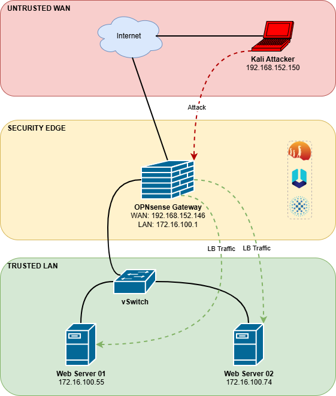
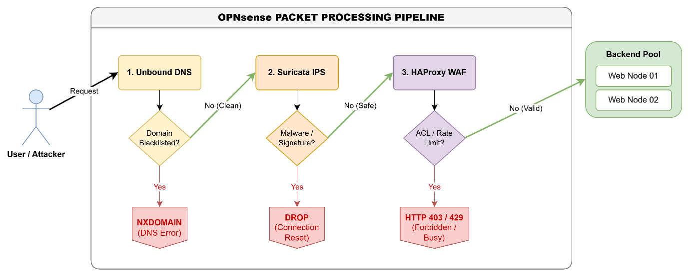
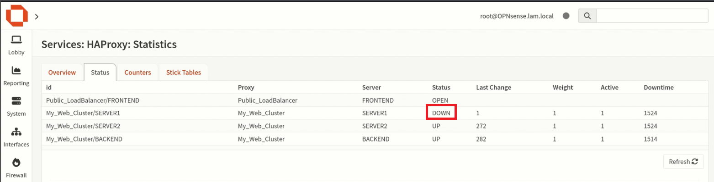
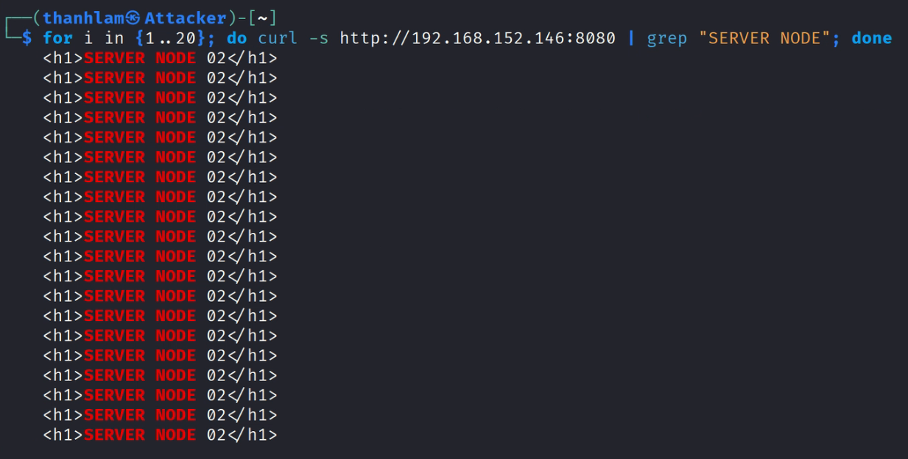
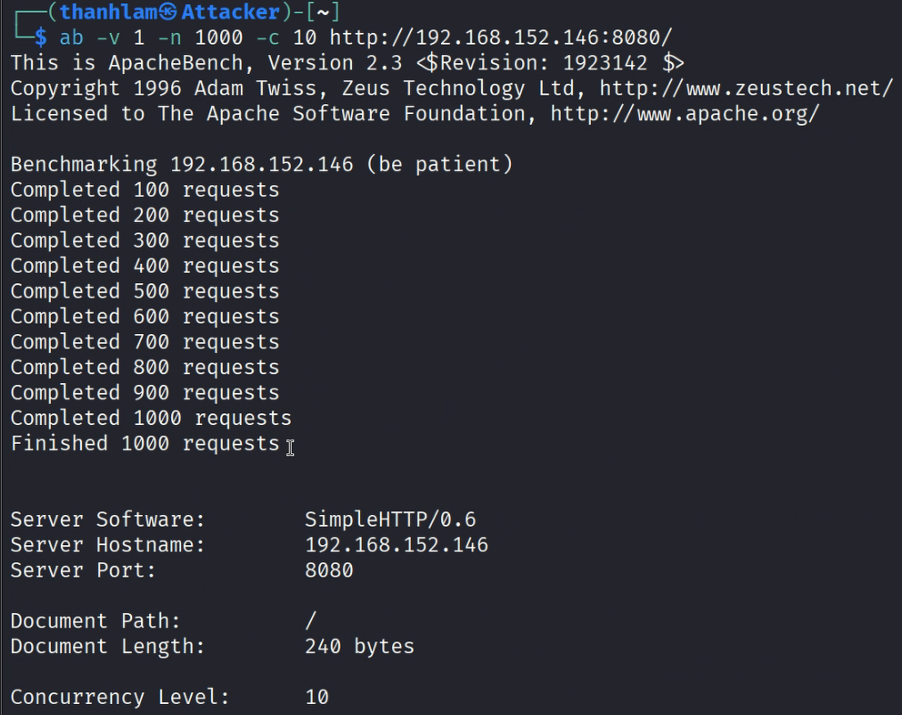
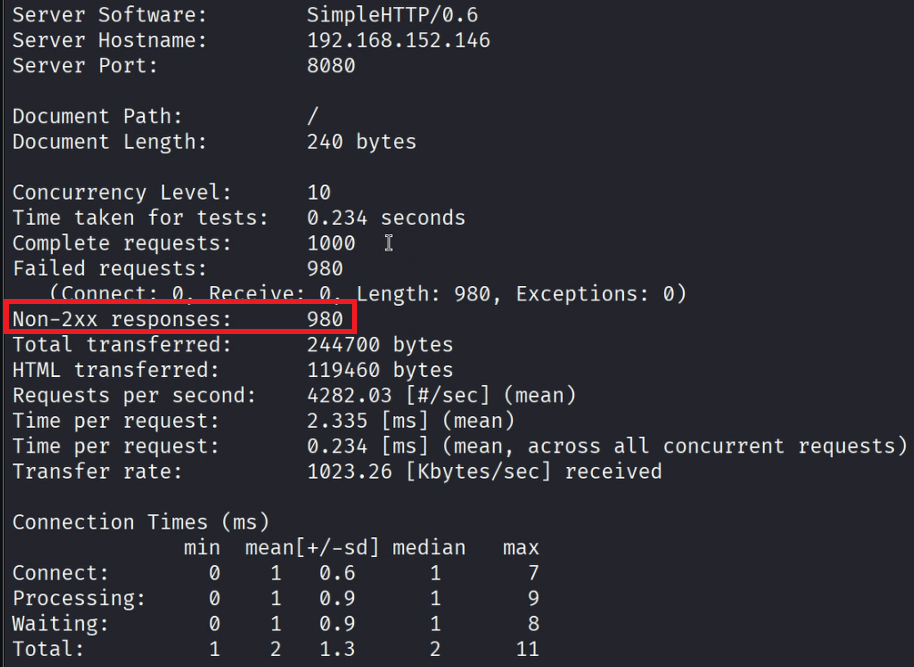

# BUILDING AN OPEN-SOURCE OPNSENSE FIREWALL WITH INTEGRATED SECURITY FEATURES

## 📌 Introduction

This project demonstrates the deployment of a secure and high-performance network infrastructure using **OPNsense**. The system integrates **Suricata (IPS)** for intrusion prevention, **Unbound DNS** for web filtering, and **HAProxy** for Layer 7 Load Balancing with ACL and Rate Limiting capabilities.

🧠 Packet Processing Pipeline
To ensure Defense in Depth, every request from the WAN interface must pass through a strict 3-layer security pipeline before reaching the internal Web Servers:

Logical Flow:

Unbound DNS: Blocks restricted domains immediately (DNS Sinkhole).

Suricata IPS: Deep Packet Inspection (DPI) to drop malware signatures.

HAProxy WAF: Filters traffic based on ACLs and Rate Limits before Load Balancing.

## 🛠️ Technology Stack

- **Core System:** OPNsense Firewall (FreeBSD based).
- **Security:** Suricata (IDS/IPS), Unbound DNS (Blacklist Filtering).
- **Load Balancing:** HAProxy (Layer 7, Round Robin, Health Checks).
- **Environment:** VMware Workstation, Kali Linux (Attacker/Client), Python Web Server.
- **Testing Tools:** cURL, Apache Benchmark (ab), Wireshark.

## 🚀 Key Features Implemented

### 1. Web Access Control (DNS Filtering)

- Blocked access to restricted domains (e.g., social media, gambling sites) using **Unbound DNS**.
- **Result:** Client received `NXDOMAIN` when accessing blocked sites.

### 2. Intrusion Prevention System (IPS)

- Deployed **Suricata** in Inline mode on WAN interface.
- Successfully detected and dropped malicious traffic (tested with EICAR test file).
- **Result:** Connection dropped immediately; Alerts logged in OPNsense.

### 3. Load Balancing & High Availability

- Configured **HAProxy** with **Round Robin** algorithm.
- **Health Check:** Automatically detects offline backend servers (simulated failure) and routes traffic to the remaining active node.
- **Access Control List (ACL):** Blocked access to `/admin` path (HTTP 403 Forbidden).

### 4. DDoS Mitigation (Rate Limiting)

- Implemented **Stick-table** strategy in HAProxy.
- **Threshold:** Limit requests > 20 reqs / 10s per Source IP.
- **Result:** Excessive requests rejected with `HTTP 429 Too Many Requests`.

## 📸 Screenshots & Evidence

### Failover Demonstration

> **Figure 1:** HAProxy Status Page. Notice that **Server 1 is marked DOWN (Red)** automatically after the health check failed, while Server 2 remains UP.

> **Figure 2:** Client Traffic Verification. The `curl` loop shows that 100% of traffic is redirected to **SERVER NODE 02**, ensuring zero downtime for users.

### DDoS Attack Blocking

> **Figure 3:** Executing the attack simulation targeting the OPNsense Gateway.

> **Figure 4:** Stress Test Results.
>
> - **Total Requests:** 1000
> - **Non-2xx responses:** 980 (Blocked by HAProxy with HTTP 429)
> - **Success Rate:** Only ~20 requests were allowed within the time window, proving the Rate Limiting is effective.

## 📂 Project Structure

- `/configs`: Configuration backups (Sanitized).
- `/scripts`: Python and HTML scripts used for Backend simulation.
- `/docs`: Detailed project documentation.

## 👨‍💻 Author

**Pham Thanh Lam** - [University of Information Technology - VNU-HCM]
